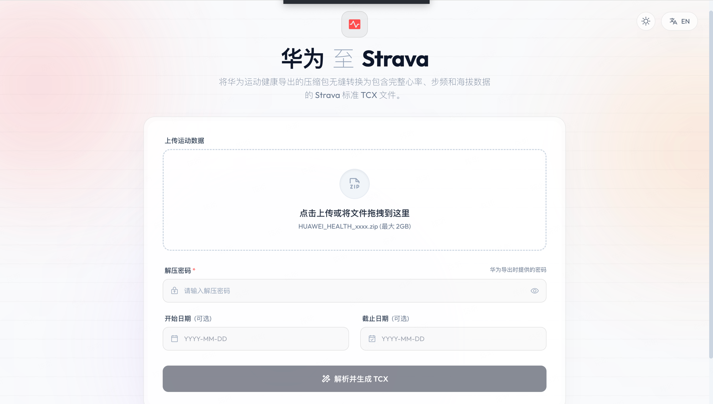
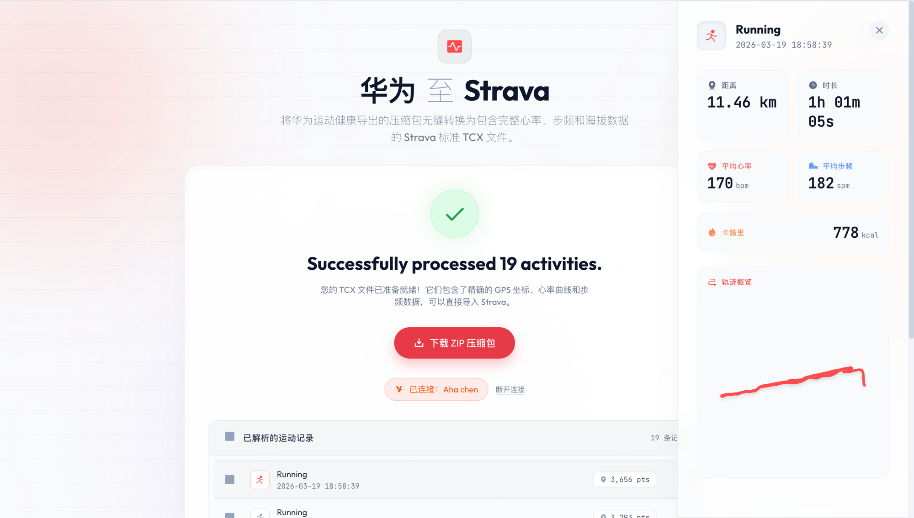

# Huawei Health Export to Strava TCX

[English](README_EN.md) | 中文

将华为运动健康导出的加密 ZIP 数据转换为 Strava 兼容的 TCX 文件。项目默认在本地运行，可保留 GPS 轨迹、心率、步频、海拔和分段等运动数据，并提供可选的 Strava OAuth 直传功能。

> 本项目是独立的开源工具，与华为或 Strava 官方无关联。

## 界面预览





## 功能特性

- 直接读取华为隐私中心导出的 AES 加密 ZIP 文件，单次上传上限为 2 GB
- 将中国境内的 GCJ-02 坐标转换为 WGS-84，改善导入 Strava 后的轨迹偏移
- 生成符合 TCX 规范的运动文件，保留心率、步频、海拔、距离和卡路里等数据
- 优先采用华为手动分段信息；没有手动分段时按每公里自动生成 Lap
- 根据手表记录的总里程校准轨迹距离，减少平台间的里程差异
- 支持户外跑步、骑行、步行，以及无 GPS 数据的室内运动
- 提供运动类型筛选、活动详情、心率与配速曲线预览
- 可选通过 Strava OAuth 将选中的活动直接上传至 Strava
- 前端依赖已本地化，基础解析流程无需访问外部 CDN

## 隐私与安全

默认情况下，上传文件、解析结果和任务状态均保存在运行本项目的设备上。临时任务目录会在任务结束一段时间后自动清理，默认保留时间为 1 小时。

启用 Strava 直传后，只有用户明确选择上传的 TCX 文件会发送至 Strava。OAuth 令牌保存在本地 SQLite 数据库中，不会写入浏览器存储。

上传接口会检查 ZIP 文件数量、单文件解压大小和预计总解压大小，以降低异常压缩包造成的资源风险。项目主要面向本地或可信网络环境，未内置完整的公网多租户认证、配额和限流机制；如需部署到公网，请在反向代理或网关层补充这些能力。

## 快速开始

### 环境要求

- Python 3.11 或 3.12
- [uv](https://docs.astral.sh/uv/)

### 本地运行

```bash
git clone https://github.com/Aha-chen/hw_sports_export.git
cd hw_sports_export

uv sync --all-groups
```

启动 API 服务：

```bash
uv run uvicorn app:app --reload --port 8000
```

另开一个终端并启动解析 worker：

```bash
uv run python worker.py
```

访问 `http://127.0.0.1:8000`。

### Docker Compose

```bash
cp .env.example .env
python -c "import secrets; print(secrets.token_hex(32))"
```

将生成的随机字符串填入 `.env` 中的 `SESSION_SECRET_KEY`，然后启动服务：

```bash
docker compose up -d
```

本机通过 HTTP 使用时保留 `COOKIE_SECURE=0`；部署到 HTTPS 后应设置为 `1`。

若需要通过带资源保护的 Nginx 示例访问，可运行：

```bash
docker compose -f docker-compose.yml -f deploy/docker-compose.proxy.yml up -d
```

随后访问 `http://127.0.0.1:8080`。示例配置位于 `deploy/nginx.conf`，包含请求体、上传速率、单 IP 并发和超时限制；正式公网部署仍需补充 TLS 与身份认证。

## 使用方法

1. 在[华为隐私中心](https://privacy.consumer.huawei.com/tool)申请导出运动健康数据。
2. 下载导出的 ZIP 文件并记录华为提供的解压密码。
3. 在本项目页面上传 ZIP 文件、输入密码，并按需设置日期范围。
4. 等待解析完成，检查活动类型、距离和数据曲线。
5. 下载生成的 TCX 压缩包，并在 [Strava 上传页面](https://www.strava.com/upload/select)批量导入；也可以配置 Strava OAuth 后直接上传。压缩包中的 `manifest.json` 会记录成功、跳过、失败数量和结构化问题。

## Strava 直传配置（可选）

1. 在 [Strava API 设置](https://www.strava.com/settings/api)中创建应用。
2. 将应用类别设置为 `Data Importer`，本地开发时将 Callback Domain 设置为 `localhost`。
3. 复制 `.env.example` 为 `.env`，配置以下变量：

```env
STRAVA_CLIENT_ID=your_client_id
STRAVA_CLIENT_SECRET=your_client_secret
SESSION_SECRET_KEY=your_random_session_secret
STRAVA_REDIRECT_URI=http://localhost:8000/api/strava/callback
```

4. 重启 API 服务。配置有效时，页面会显示“连接 Strava”入口。

生产环境应使用固定的 HTTPS 回调地址，并设置 `COOKIE_SECURE=1`。

## 项目结构

| 路径 | 说明 |
| --- | --- |
| `app.py` | FastAPI 应用、上传校验、任务状态流和结果下载 |
| `worker.py` | 独立解析 worker 与任务恢复 |
| `core/parser.py` | 华为数据解析、坐标转换和 TCX 生成 |
| `core/task_store.py` | SQLite 任务队列与状态持久化 |
| `core/strava_store.py` | Strava OAuth 令牌的服务端存储 |
| `routers/strava.py` | Strava OAuth 与活动上传接口 |
| `templates/`、`static/` | Web 页面和本地化前端资源 |
| `tests/` | 解析、任务队列和接口测试 |

API 与 worker 通过 `temp/tasks.sqlite3` 协作，文件存储在对应任务目录中。Docker Compose 默认运行一个 API 容器和一个 worker 容器，并共享 `temp` 卷。

## 开发与验证

```bash
uv sync --all-groups
make check
```

`pyproject.toml` 是依赖配置的唯一来源，`uv.lock` 固定完整依赖集合。`make check` 会检查 lock 一致性，并依次执行 Ruff、Bandit、自动测试和运行依赖漏洞审计；`make docker` 可额外验证容器构建。

服务健康检查地址为 `GET /healthz`。

当前存储方案适合单机部署。如需多节点或多 worker 部署，应将任务状态和临时文件迁移到共享数据库与对象存储，并重新评估任务租约、并发和清理策略。

## 已知限制

- 华为可能调整导出数据结构；尚未覆盖的格式需要根据样本适配。
- 室内运动没有真实 GPS 轨迹时，会根据配速或时间数据生成用于 TCX 展示的合成轨迹。
- 不同设备、运动类型和 Strava 的导入策略可能造成少量指标差异。

## 贡献

欢迎通过 Issue 报告可复现的问题，或通过 Pull Request 提交改进。涉及解析兼容性的问题，请尽量说明设备型号、运动类型和经过脱敏的数据结构特征，不要公开真实健康数据或账号凭证。

## 许可证

本项目采用 [MIT License](LICENSE)。

## 开发说明

项目开发过程中使用了 AI 编程工具辅助代码生成、重构和测试；最终功能仍需通过项目测试及实际数据验证。
