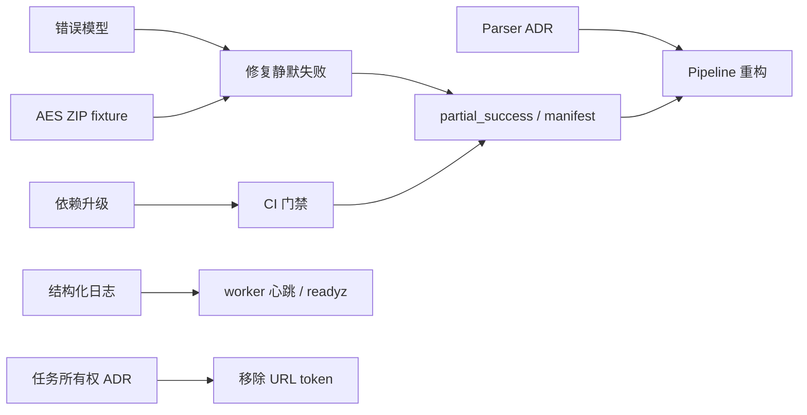

# Huawei Health Export Tool：未来产品与工程路线图

> 状态：Active Draft｜版本：0.1｜日期：2026-07-28｜性质：规划性文档（Non-normative）

## 1. 文档职责

本文负责安排项目未来阶段、优先级、交付物和退出标准。它回答的是：

- 当前最值得先解决什么；
- 各阶段的目标和依赖是什么；
- 怎样判断一个阶段可以结束；
- 哪些能力暂缓，等待真实需求。

工程与架构强约束由 [SPEC.md](SPEC.md) 定义。本文不得覆盖 SPEC；如果路线目标需要改变架构、接口、安全或质量规范，必须先更新 SPEC 或建立 ADR。

本文允许随用户反馈、风险、维护能力和依赖变化而调整，不承诺固定发布日期。

## 2. 当前判断

### 2.1 当前可用程度

项目已经具备完整的本地闭环：

- 上传华为加密 ZIP；
- 独立 worker 解析；
- 运动列表和曲线预览；
- TCX 打包下载；
- 可选 Strava OAuth 直传；
- Docker Compose 单机部署。

当前适合作为本地或可信网络工具使用，不应在没有入口保护、认证、限流和可观测性的情况下直接作为匿名公网服务。

### 2.2 质量基线

截至 2026-07-28：

- 25 项自动测试在 Python 3.11 和 3.12 均通过；
- 合成 AES ZIP 已覆盖正常密码、错误密码、损坏归档和活动级部分失败；
- 已升级已知存在漏洞的直接运行依赖，当前依赖审计未发现已知漏洞；
- parser、worker 和前端已能区分密码错误、损坏归档、整体失败和 `partial_success`；
- 已提供统一的 `make check`，包含 lock、Ruff、Bandit、测试和依赖审计；
- 已迁移到 `pyproject.toml` 和 `uv.lock`，并建立 Python 3.11 / 3.12 与 Docker build CI；
- 下载包包含 `manifest.json`，记录成功、跳过、失败数量和结构化问题；
- 已提供带请求体、速率、单 IP 并发和超时限制的 Nginx 部署示例；
- 上传大小限制发生在框架 multipart 接收之后；
- 任务、token、清理和 worker 状态的可观测性有限。

## 3. 优先级规则

路线工作按以下顺序判断：

1. **P0 安全和数据正确性**：可能导致攻击、数据遗漏或错误结果；
2. **P1 可靠性和可诊断性**：可能导致任务无法恢复、无法解释或敏感数据滞留；
3. **P2 可维护性和性能**：降低后续格式适配和功能开发成本；
4. **P3 扩展能力**：只有真实使用量或部署需求出现后投入。

若某项新功能会扩大现有 P0/P1 风险，应先处理风险，不应以功能开发绕过。

## 4. Phase 0：安全与正确性基线

### 4.1 目标

消除当前最直接的依赖风险、静默失败和关键测试空白，使“任务成功”真正代表结果可信。

### 4.2 计划交付

当前进度：`Done`。本阶段交付已于 2026-07-28 在本地完成；GitHub Actions 会在下一次推送或 Pull Request 时持续执行相同门禁。

- 升级 FastAPI、python-multipart、Jinja2、pyzipper 等运行依赖；
- 迁移到 `pyproject.toml` 与 lock file；
- 建立 Python 3.11 / 3.12 CI；
- 增加 Ruff、Bandit、依赖审计和 Docker build 门禁；
- 定义稳定错误码和异常类型；
- 区分密码错误、ZIP 损坏、schema 不支持和活动级失败；
- 删除 parser 中无条件吞异常的路径；
- 增加 `partial_success` 和结果 manifest；
- 建立合成 AES ZIP 集成 fixture；
- 在代理部署示例中增加请求体、超时和并发限制。

### 4.3 退出标准

- 运行依赖不存在有可用修复的 High/Critical 漏洞；
- 错误密码稳定返回 `INCORRECT_PASSWORD`；
- 单活动失败会出现在 manifest，其他成功活动仍可下载；
- CI 在 Python 3.11 / 3.12 全部通过；
- 加密 ZIP 正常、错误密码、损坏和部分失败路径均有测试。

验收结果：运行依赖审计未发现已知漏洞；`INCORRECT_PASSWORD` 已覆盖 parser 和 worker；活动级失败进入数据库、SSE 和下载包 manifest；Python 3.11 / 3.12 各 25 项测试通过；CI 工作流包含双版本测试、Ruff、Bandit、依赖审计和 Docker build。

### 4.4 主要风险

- FastAPI/Starlette 跨多个版本升级可能改变 TestClient、multipart 和响应行为；
- pyzipper 新版本可能影响现有 AES ZIP 兼容性；
- 错误模型调整需要同步前端提示。

## 5. Phase 1：可靠性、隐私与可观测性

### 5.1 目标

让任务的执行、失败、恢复和清理可以追踪，并减少密码和 token 暴露面。

### 5.2 计划交付

- 结构化日志和统一 task correlation；
- 独立 worker 心跳；
- `/readyz` 就绪检查；
- 任务 lease、最大重试和取消；
- 清理失败重试、状态和指标；
- 任务所有权绑定服务端会话；
- 从 URL 移除任务 token；
- Strava token TTL、过期清理和安全存储；
- SSE 心跳和断线恢复；
- 补齐 Strava OAuth、刷新、上传、限流和重复活动测试；
- 总覆盖率提升到 80%。

### 5.3 退出标准

- 可通过 task ID 关联 API、worker、parser 和 Strava 日志；
- worker 被强制终止后，任务能够恢复且不产生重复成功产物；
- 密码和 token 不出现在 URL、访问日志和测试 fixture；
- 清理器失败可见并会重试；
- 总覆盖率不低于 80%，关键路径达到 SPEC 门槛。

### 5.4 主要风险

- 会话绑定会改变当前前端保存和恢复任务的方式；
- 任务状态迁移需要 SQLite schema migration；
- token 加密引入密钥生命周期问题，需要 ADR。

## 6. Phase 2：解析器模块化与性能基线

### 6.1 目标

降低适配新华为格式、排查转换差异和处理大文件的成本。

### 6.2 计划交付

- 将 parser 拆分为 inspect、decode、normalize、validate、convert、export；
- 引入稳定的 Activity、TrackPoint 和 Lap 领域模型；
- 独立 TCX exporter；
- 建立 TCX 黄金测试；
- 使用有界队列代替无界 Future；
- 评估流式 JSON 或分批解析；
- 建立标准性能样本和基准命令；
- 检测输出文件名碰撞；
- 明确日期筛选的时区语义；
- 将前端拆分为上传、任务、图表和 Strava 模块。

### 6.3 退出标准

- 新增华为 schema adapter 不需要修改 API 和 TCX exporter；
- parser 核心覆盖率不低于 90%；
- 大样本峰值内存有基线、上限和回归检测；
- 相同输入的 TCX 关键结构可重复；
- 部分活动错误不会中断其他活动，也不会被隐藏。

### 6.4 主要风险

- 大规模重构容易引入细微数值差异；
- 需要保留真实行为的脱敏黄金样本；
- 流式解析库会增加依赖和格式耦合。

## 7. Phase 3：产品体验与兼容性扩展

### 7.1 启动条件

Phase 0 至 Phase 2 基线稳定，并且有明确用户反馈或兼容样本。

### 7.2 候选能力

- 更清晰的活动级错误和修复建议；
- 解析前的归档内容预检；
- 单活动重新生成和下载；
- 任务取消与手动删除；
- 更多华为运动类型和导出版本；
- 可选择的距离校准策略；
- TCX 之外的格式评估，例如 GPX/FIT（需单独产品论证）；
- 更完整的可访问性和移动端 Web 体验；
- 中英文错误文案统一管理。

候选功能进入实施前必须明确用户价值、隐私影响、兼容策略和测试样本。

## 8. Phase 4：可选共享部署能力

### 8.1 启动条件

只有出现真实的以下需求时启动：

- 单机资源无法满足使用量；
- 需要多个 API 或 worker 实例；
- 需要可靠的远程任务和产物存储；
- 有明确的认证、配额和审计需求。

### 8.2 候选交付

- `TaskRepository`、`ArtifactRepository`、`SecretRepository` 接口；
- PostgreSQL 或其他共享任务存储；
- 对象存储 adapter；
- 分布式 lease 和幂等产物；
- 用户认证、配额、限流和审计日志；
- 多 worker 压力、重复消费和故障测试；
- 备份、恢复和数据删除策略。

该阶段不是默认目标，不能提前把本地模式复杂化。

## 9. 建议里程碑

| Milestone | 对应阶段 | 核心结果 | 状态 |
| --- | --- | --- | --- |
| M0 Security Baseline | Phase 0 | 依赖升级、错误透明、基础 CI | Done |
| M1 Reliable Tasks | Phase 1 | 可恢复、可观测、token 收敛 | Planned |
| M2 Parser Pipeline | Phase 2 | 模块化、黄金测试、内存有界 | Planned |
| M3 Product Polish | Phase 3 | 兼容与体验改进 | Backlog |
| M4 Shared Runtime | Phase 4 | 可选多实例部署 | Deferred |

状态值限定为：

- `Planned`
- `In Progress`
- `Blocked`
- `Done`
- `Deferred`

## 10. 推荐的首批任务拆分

建议按以下顺序建立 Issue：

1. [已完成] 升级并锁定运行依赖；
2. [已完成] 建立 GitHub Actions 测试与安全门禁；
3. [已完成] 定义领域异常和 API 错误码；
4. [已完成] 修复错误密码被吞和活动静默失败；
5. [已完成] 添加合成 AES ZIP 集成 fixture；
6. [已完成] 引入 `partial_success` 与 manifest；
7. [已完成] 增加入口代理资源限制示例；
8. 添加清理日志和 worker 独立心跳；
9. 设计任务所有权与 URL token 迁移 ADR；
10. 设计 parser pipeline 拆分 ADR。

依赖关系：

## 11. 暂缓事项

以下事项在没有数据支持前保持 Deferred：

- Kubernetes 部署；
- 专用消息队列；
- 微服务拆分；
- 多租户账号系统；
- 长期云端健康数据存储；
- 原生桌面或移动客户端；
- 为追求并发而提前引入进程池或分布式 worker。

## 12. 路线图维护规则

- ROADMAP 可以频繁更新优先级、阶段和状态，但不得降低 SPEC 门槛。
- 每个 `In Progress` 里程碑应关联具体 Issue。
- 新增产品能力前，应记录用户问题、预期价值和验证方式。
- 阻塞项必须说明阻塞原因和解除条件。
- 完成项保留结果链接和版本，不直接删除。
- 每个正式版本后复盘路线假设，并更新下一阶段。
- 若路线需要改变架构、接口、安全或质量规范，先修改 SPEC 或新增 ADR。
