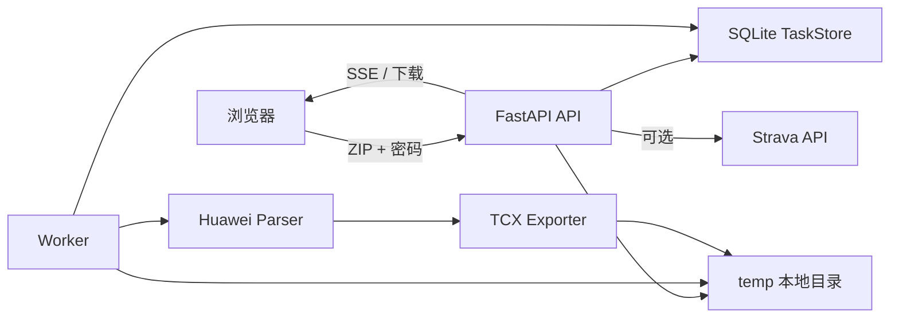
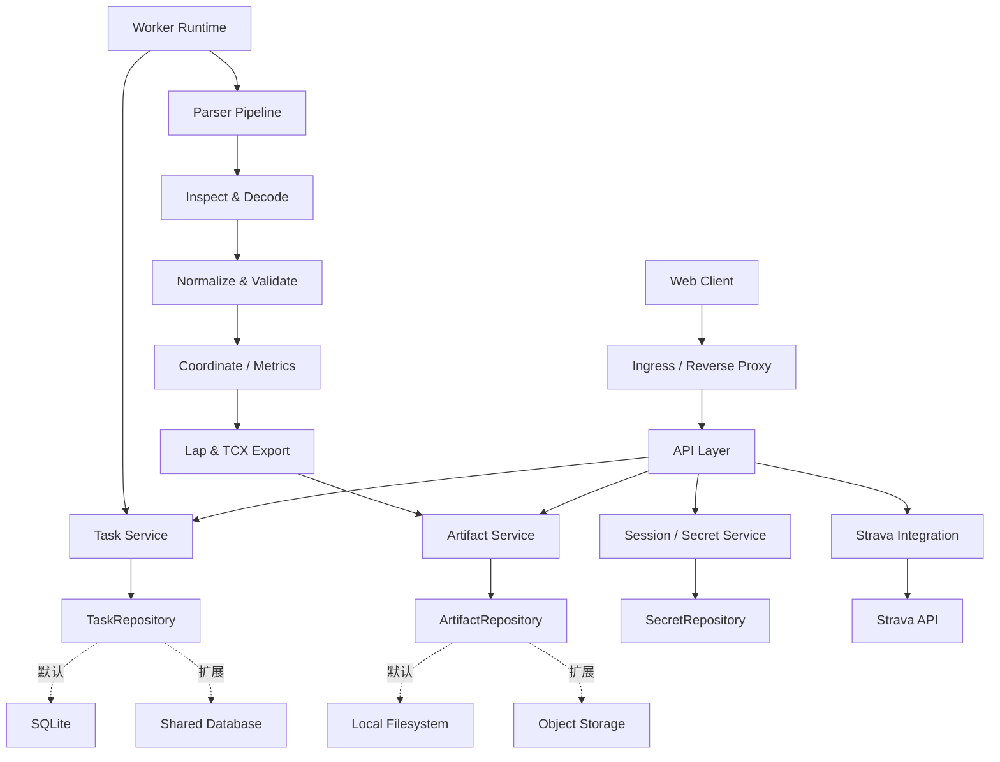
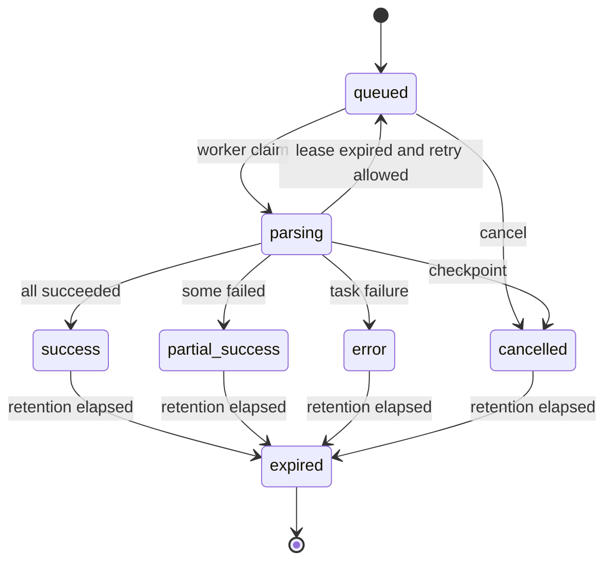

# Huawei Health Export Tool：工程与架构 SPEC

> 状态：Draft｜版本：0.2｜日期：2026-07-28｜性质：规范性文档（Normative）

## 1. 文档职责

本文定义项目长期有效的架构边界、开发规范、接口约束、安全要求和质量门槛。它回答的是：

- 系统由哪些职责明确的组件组成；
- 组件之间允许如何依赖；
- 功能、接口、数据和任务状态必须满足什么约束；
- 代码达到什么条件才允许合并和发布。

本文**不负责**：

- 规定具体发布日期；
- 安排季度或迭代优先级；
- 跟踪某项工作的完成百分比；
- 替代单个功能的设计文档、Issue 或 ADR。

路线顺序、阶段目标和交付节奏见 [ROADMAP.md](ROADMAP.md)。

## 2. 文档层级与冲突处理

项目文档按以下层级生效：

1. **SPEC**：架构和工程强约束；
2. **ADR**：针对具体技术决策解释如何满足或有条件调整 SPEC；
3. **ROADMAP**：阶段顺序、优先级和交付目标；
4. **Issue / PR**：具体实现任务。

约束规则：

- ROADMAP、Issue 和 PR 不得绕过 SPEC。
- 如果路线目标与 SPEC 冲突，必须先修改 SPEC 或通过 ADR 明确例外。
- ADR 不得静默改变公开接口或隐私边界；涉及这类变化时必须同步修改 SPEC。
- 当前代码与 SPEC 不一致时，代码代表现状，SPEC 代表目标约束；ROADMAP 应负责安排差距收敛。

本文使用以下关键词：

- **MUST**：必须满足；不满足不得视为完成。
- **SHOULD**：原则上满足；偏离时必须在 ADR 或 PR 中说明原因。
- **MAY**：可选能力。

## 3. 产品范围

### 3.1 产品定位

本项目是 local-first 的华为运动健康数据转换工具，职责包括：

1. 读取华为隐私中心导出的加密 ZIP；
2. 提取、验证和标准化运动数据；
3. 将 GCJ-02 坐标转换为 WGS-84；
4. 生成 Strava 兼容的 TCX；
5. 提供本地下载和可选的 Strava OAuth 直传。

### 3.2 设计原则

- **本地优先**：默认解析链路不依赖外部云服务。
- **隐私优先**：健康数据、密码和令牌均按敏感数据处理。
- **显式失败**：不得静默丢弃文件、活动或关键指标。
- **资源有界**：上传、解压、解析、排队、并发和重试均有上限。
- **结果可复现**：相同输入和配置产生语义一致的输出。
- **渐进扩展**：保持单机模式简单，通过接口支持未来共享部署。
- **向后兼容**：公开接口和产物发生破坏性变化时必须提供迁移路径。

### 3.3 非目标

- 默认提供匿名公网多租户 SaaS；
- 长期托管用户健康数据；
- 替代华为或 Strava 官方服务；
- 在没有代表性样本的前提下承诺兼容所有导出格式；
- 原生移动客户端。

## 4. 当前架构基线

| 组件 | 当前实现 | 职责 |
| --- | --- | --- |
| Web/API | `app.py`、FastAPI | 上传、校验、SSE、下载、会话 |
| Worker | `worker.py` | 领取任务、解析、打包结果 |
| Parser | `core/parser.py` | 解密、标准化、坐标与 TCX |
| Task Store | `core/task_store.py`、SQLite | 队列、状态、worker 租约 |
| Strava Store | `core/strava_store.py`、SQLite | OAuth token |
| Strava API | `routers/strava.py` | OAuth、上传和状态查询 |
| Frontend | `templates/`、`static/` | 上传、进度、预览和下载 |
| Artifact Store | `temp/` | ZIP、任务文件和输出产物 |

当前默认部署是一个 API 和一个 worker，共享本地 `temp` 卷。worker 一次领取一个任务；parser 内部最多使用 4 个线程处理活动。该行为属于现状，不代表已具备安全的多 worker 扩展能力。



## 5. 目标架构规范

### 5.1 目标逻辑组件



### 5.2 模块依赖规则

项目 SHOULD 逐步形成以下逻辑边界，不要求一次性重写目录：

```text
app/
├── api/                 # HTTP、SSE、请求/响应模型
├── services/            # 任务、上传、清理和业务编排
├── domain/              # 任务状态、错误码、规范活动模型
├── infrastructure/      # SQLite、文件、配置、日志
├── parsers/huawei/      # 华为格式识别、读取和标准化
├── exporters/tcx/       # TCX 模型与序列化
└── integrations/strava/ # OAuth 和上传客户端
```

依赖 MUST 遵守：

- `app.py` 和 `worker.py` 只负责启动与依赖装配。
- parser 不得依赖 HTTP、SQLite、模板或 Strava。
- TCX exporter 只接收规范领域模型，不读取华为原始结构。
- API 不得直接依赖 parser 的内部字典。
- service 层负责状态转换和用例编排。
- infrastructure 通过 repository 接口向上提供能力。
- Strava 集成不得直接访问 parser 内部对象。

## 6. 功能行为规范

| ID | 级别 | 需求 | 验收标准 |
| --- | --- | --- | --- |
| FR-001 | MUST | 接收华为加密 ZIP 与密码 | 合法请求返回 `202` 和任务 ID；错误返回稳定错误码 |
| FR-002 | MUST | 限制上传和解压资源 | 请求体、文件数、条目、解压总量、磁盘水位均有上限 |
| FR-003 | MUST | 异步解析 | API 不执行长解析；任务状态可查询 |
| FR-004 | MUST | 生成有效 TCX | 产物通过 schema 或黄金样本验证 |
| FR-005 | MUST | 坐标转换正确 | 中国境内满足误差阈值；境外坐标不误转 |
| FR-006 | MUST | 报告部分失败 | 返回成功、跳过、失败数量及结构化原因 |
| FR-007 | MUST | 保护结果下载 | 只有任务所有者可访问；过期后统一返回错误 |
| FR-008 | SHOULD | Strava 直传 | OAuth、刷新、限流、重复和失败均有测试 |
| FR-009 | MUST | 清理临时数据 | 成功、失败、取消、过期路径均清理且可观测 |
| FR-010 | SHOULD | 日期筛选 | 时区语义明确，并有边界测试 |
| FR-011 | SHOULD | 任务取消 | 排队任务立即取消；执行任务在安全点停止 |
| FR-012 | SHOULD | 兼容旧接口 | 新接口上线后旧接口至少保留一个小版本 |

## 7. 任务模型规范

### 7.1 状态集合

- `queued`
- `parsing`
- `success`
- `partial_success`
- `error`
- `cancelled`
- `expired`



### 7.2 必备字段

任务记录 MUST 包含或可推导：

- `task_id`
- `status` / `phase`
- `current` / `total`
- `success_count` / `skipped_count` / `failed_count`
- `warnings`
- `error_code` / `error_message`
- `created_at` / `updated_at` / `expires_at`
- `worker_id` / `lease_expires_at`
- `attempts` / `max_attempts`
- `artifact_manifest`
- `owner_session_id` 或等价所有权标识

### 7.3 状态约束

- `success` 表示没有任何 issue（含活动级与文件级）；有可下载结果但存在任意 issue 时使用 `partial_success`。
- worker 只有持有有效 lease 时才能更新执行状态。
- lease 心跳不得仅依赖单条活动完成。
- 超过最大尝试次数后必须进入 `error`。
- 终态不得直接回到 `parsing`；重试应创建新 attempt 或新任务。
- 产物写入必须幂等，重复 worker 不得产生相互覆盖的不一致结果。
- 无成功结果时的任务级 `error` 码 MUST 稳定、与 issue 收集顺序无关；日期范围筛空使用 `NO_MATCHING_ACTIVITIES`，与 `NO_ACTIVITIES` 区分。

## 8. API 规范

### 8.1 版本与兼容

- 新接口统一使用 `/api/v1`。
- 当前接口在迁移期作为兼容层保留。
- 外部响应使用稳定 schema，不暴露数据库字段、绝对路径或第三方原始响应。
- 破坏性变化必须提供弃用说明和迁移周期。

### 8.2 目标接口

| Method | Path | 用途 |
| --- | --- | --- |
| `POST` | `/api/v1/tasks` | 创建解析任务 |
| `GET` | `/api/v1/tasks/{task_id}` | 查询任务快照 |
| `GET` | `/api/v1/tasks/{task_id}/events` | SSE 进度与心跳 |
| `GET` | `/api/v1/tasks/{task_id}/artifacts/archive` | 下载结果包 |
| `DELETE` | `/api/v1/tasks/{task_id}` | 取消或清理任务 |
| `POST` | `/api/v1/tasks/{task_id}/strava-uploads` | 上传选中活动 |
| `GET` | `/api/v1/strava/status` | Strava 连接状态 |
| `GET` | `/healthz` | 进程存活检查 |
| `GET` | `/readyz` | 存储和 worker 就绪检查 |

任务所有权 SHOULD 绑定 HttpOnly 会话 Cookie 或服务端会话。任务 token MUST NOT 出现在 URL 查询参数中。

### 8.3 错误结构

```json
{
  "error": {
    "code": "INVALID_ARCHIVE",
    "message": "Archive is invalid or unsupported",
    "retryable": false,
    "details": {}
  }
}
```

必须定义：

- `UPLOAD_TOO_LARGE`
- `ARCHIVE_LIMIT_EXCEEDED`
- `DISK_CAPACITY_LOW`
- `INVALID_ARCHIVE`
- `INVALID_DATE`
- `INVALID_DATE_RANGE`
- `INVALID_TASK_ID`
- `INCORRECT_PASSWORD`
- `UNSUPPORTED_EXPORT_SCHEMA`
- `NO_ACTIVITIES`
- `NO_MATCHING_ACTIVITIES`
- `PARTIAL_PARSE_FAILURE`
- `TASK_NOT_FOUND`
- `TASK_EXPIRED`
- `TASK_UNAUTHORIZED`
- `TASK_TIMEOUT`
- `STRAVA_NOT_CONFIGURED`
- `STRAVA_AUTH_EXPIRED`
- `STRAVA_RATE_LIMITED`
- `INTERNAL_ERROR`

错误信息不得包含密码、token、原始健康数据或绝对路径。

## 9. Parser Pipeline 规范

解析器 SHOULD 拆分为：

1. Archive inspection；
2. Decode；
3. Schema detection；
4. Normalization；
5. Validation；
6. Coordinate / metric conversion；
7. Lap / TCX export；
8. Result manifest。

### 9.1 错误处理

- 密码或解密错误 MUST 终止任务并返回明确错误码。
- 单活动格式错误 MAY 降级为活动级失败，但必须写入 manifest。
- JSON 读取失败不得被无条件 `continue` 吞掉。
- Future 或线程异常必须保留活动标识和异常类别。
- 日志只记录脱敏上下文，不记录完整活动内容。

### 9.2 内存和并发

- 条目读取、JSON 解码、待处理活动和结果集合 MUST 各自有上限。
- 不得为文件内所有活动一次性创建无界 Future。
- worker 数、任务内并发和内存预算必须可配置。
- 引入进程池或增加并发前必须有基准数据。
- 大文件 SHOULD 使用流式 JSON 或分批处理。

### 9.3 确定性

- Activity、Lap 和 TrackPoint 顺序必须稳定。
- 输出文件名碰撞必须检测和消除。
- 同一输入、配置和时区数据库版本下，关键输出应一致。
- TCX SHOULD 包含生成器版本信息。

## 10. 安全与隐私规范

### 10.1 依赖供应链

- 运行依赖不得存在有修复版本的 High/Critical 漏洞。
- FastAPI 与 Starlette 必须使用官方兼容范围。
- 依赖通过 `pyproject.toml` 和 lock file 管理。
- CI 必须运行依赖漏洞扫描。
- Docker 基础镜像 SHOULD 固定明确版本或 digest。

### 10.2 入口和资源保护

- 入口层 MUST 在 multipart 解析前限制请求体。
- API MUST 限制同时上传、排队任务和来源速率。
- 创建任务前 MUST 检查磁盘水位。
- ZIP 文件数、单条目、解压总量、压缩比和 JSON 大小必须可配置。
- 公网部署必须启用 TLS、可信 Host 和正确代理头。

### 10.3 敏感数据

- 任务目录 SHOULD 为 `0700`；密码和 token 文件为 `0600`。
- 密码只保留到任务不再需要时，并立即删除。
- Strava refresh token SHOULD 加密或存入系统密钥服务。
- OAuth 会话必须有 TTL，过期后清理服务端 token。
- URL、日志、异常、指标和 fixture 禁止出现真实密码或 token。
- 测试数据必须合成或彻底脱敏。

### 10.4 数据保留

- 默认任务保留 1 小时，并允许配置。
- 清理失败必须记录、重试和暴露状态。
- 用户主动删除后必须在可观测的有限时间内清理。
- 健康数据不得因为调试需要无限期保留。

## 11. 开发与代码风格规范

### 11.1 注释语言

- 新增或修改的业务代码注释和 docstring MUST 以中文为主。
- 类名、函数名、字段名、协议名、错误码和无法准确翻译的行业术语 MAY 保留英文，并使用反引号标识。
- 面向用户的中英文文案、第三方协议字段和公开 API schema 不受本条限制，不得为了统一注释语言而改变其语义。
- 现有英文注释 MAY 渐进迁移；修改相关代码时 SHOULD 一并校正或改写有维护价值的注释，不要求脱离功能变更进行机械翻译。

### 11.2 必须或应当注释的内容

注释的目标是补充代码本身无法清楚表达的信息。以下内容 MUST 或 SHOULD 添加简洁中文注释：

- 非显而易见的业务规则、设计取舍以及“为什么这样实现”；
- 华为导出格式、TCX、Strava 等外部格式的字段含义、单位、兼容差异和经验性假设；
- 坐标、距离、步频、时间、时区和 Lap 等转换公式及其边界条件；
- 任务状态迁移、并发、lease、重试、幂等和资源上限等关键不变量；
- 降级、跳过、部分成功、异常映射和清理路径；
- 安全或隐私相关约束，例如密码、token、临时文件和日志脱敏；
- 容易被后续维护者误删、误改或误判为冗余的代码。

复杂模块、公共类以及行为不直观的公共函数 SHOULD 使用中文 docstring，说明职责、关键参数、返回值和可能抛出的领域异常。简单私有函数若命名已完整表达行为，MAY 不添加 docstring。

### 11.3 注释质量

- 注释 MUST 说明意图、约束或原因，不得只是逐句翻译代码语法。
- 注释 MUST 与实现同步；修改行为、单位、边界或异常语义时，必须同时更新相邻注释。
- 注释 SHOULD 靠近其约束的代码，保持短小、明确且可验证；长篇背景应放入 SPEC、ADR 或专门设计文档。
- 不得保留大段已注释掉的旧代码；历史原因应由 Git 和 ADR 记录。
- `TODO` / `FIXME` MUST 描述具体未完成事项；长期任务 SHOULD 关联 Issue，不能用含糊注释代替设计。
- 注释、docstring、示例和测试 fixture 不得包含真实健康数据、密码、token、邮箱或其他个人信息。
- 评审注释质量时以“是否降低理解和误改成本”为标准，不以注释行数为目标。

### 11.4 命名与可读性

- Python 标识符遵循 PEP 8，变量和函数使用 `snake_case`，类使用 `PascalCase`，常量使用 `UPPER_SNAKE_CASE`。
- 名称 SHOULD 优先表达领域含义和单位，例如使用 `start_time_ms` 而不是 `value` 或 `time`。
- 不应依靠注释弥补含糊命名、过长函数或职责混杂；遇到此类代码 SHOULD 先拆分或重命名，再补充必要说明。
- 用户可见文案与错误码分离；错误码保持稳定英文标识，展示文案按语言本地化。

## 12. 非功能要求

| ID | 领域 | 要求 |
| --- | --- | --- |
| NFR-001 | 正确性 | 核心转换有黄金样本；不得静默丢活动 |
| NFR-002 | 安全 | CI 无可修复 High/Critical 运行依赖漏洞 |
| NFR-003 | 测试 | 总覆盖率至少 80%；parser、任务、Strava 核心路径至少 90% |
| NFR-004 | 可维护性 | Ruff 零错误；Bandit 无未解释的 Medium/High |
| NFR-005 | 兼容性 | 至少持续测试 Python 3.11 和 3.12 |
| NFR-006 | 可观测性 | API、worker、parser 和 Strava 可通过 task ID 关联 |
| NFR-007 | 性能 | 标准样本无超过 20% 的无解释性能退化 |
| NFR-008 | 可靠性 | worker 异常后任务可恢复且不重复成功产物 |
| NFR-009 | 隐私 | 终态任务按 TTL 清理；失败可观测 |
| NFR-010 | 可复现性 | lock file 和容器可复现依赖集合 |

## 13. 可观测性规范

### 13.1 日志

结构化日志 SHOULD 包含：

- `timestamp`
- `level`
- `service`
- `task_id`
- `worker_id`
- `phase`
- `event`
- `duration_ms`
- `error_code`

不得记录完整密码、OAuth token、任务 token、完整轨迹或原始活动 JSON。

### 13.2 指标

目标指标至少包括：

- 任务队列深度和运行数；
- 各终态任务总数；
- 各阶段耗时；
- 活动成功、跳过、失败数；
- parser 错误分类；
- worker 心跳年龄；
- 清理失败数；
- 临时目录磁盘用量。

### 13.3 健康检查

- `/healthz` 仅检查进程存活。
- `/readyz` 检查任务存储、artifact 存储和 worker 心跳。
- worker 必须独立心跳，不依赖活动进度回调。

## 14. 测试规范

### 14.1 测试层级

1. 单元测试：坐标、距离、步频、时间、Lap、错误映射；
2. 契约测试：API schema、错误码和状态迁移；
3. 集成测试：API + SQLite + worker + 合成 AES ZIP；
4. 黄金测试：固定输入与稳定 TCX 指标；
5. 安全测试：multipart、ZIP 元数据、路径、Host 和 token；
6. 属性/模糊测试：JSON 修复、坐标和时间序列；
7. 端到端测试：上传、进度、预览、下载和 mock Strava。

### 14.2 必备 fixture

- 正确密码和错误密码 AES ZIP；
- 损坏、截断、无活动和异常 JSON ZIP；
- 单活动失败、其他活动成功；
- 户外跑、骑行、步行和室内运动；
- 手动 Lap 和自动 Lap；
- 中国境内、境外和坐标边界；
- UTC 与本地日期边界；
- 输出文件名碰撞。

fixture 不得包含真实身份、完整真实轨迹或有效凭证。

## 15. CI 与发布规范

### 15.1 合并门禁

每个 PR MUST 通过：

- Python 3.11 / 3.12 测试矩阵；
- Ruff；
- Bandit；
- 依赖漏洞扫描；
- 覆盖率门槛；
- Docker build；
- 关键文档与配置检查。

### 15.2 依赖

- 新依赖必须说明用途、维护状态、许可证和体积影响。
- 直接和间接依赖必须进入 lock file。
- 自动依赖更新 SHOULD 每周运行。
- 安全更新不能绕过测试。

### 15.3 发布

- 使用语义化版本；
- 维护 CHANGELOG；
- 发布前生成依赖清单或 SBOM；
- Release notes 说明变化、迁移和已知限制；
- 容器镜像必须能对应源码 tag。

## 16. Definition of Done

功能或重构只有同时满足以下条件才算完成：

- 需求和验收标准明确；
- 架构边界符合 SPEC，或已有 ADR；
- 正常、边界和失败路径有测试；
- 不降低覆盖率门槛；
- Ruff、Bandit、依赖审计和 Docker build 通过；
- 日志、URL、fixture 和异常不泄露敏感数据；
- 用户可见变化更新 README/CHANGELOG；
- 数据或 API 变化有兼容和回滚说明；
- 错误码、指标和运维方式可用。

## 17. SPEC 变更规则

- SPEC 使用版本号管理，变更必须通过 PR 评审。
- 纯排期变化不得修改 SPEC，应修改 ROADMAP。
- 改变架构边界、状态语义、公开接口、安全要求或质量门槛时必须修改 SPEC。
- 重大决策必须新增 ADR，并在 SPEC 中链接稳定结论。
- 每次正式发布前检查 SPEC、代码、README 和部署配置是否一致。
